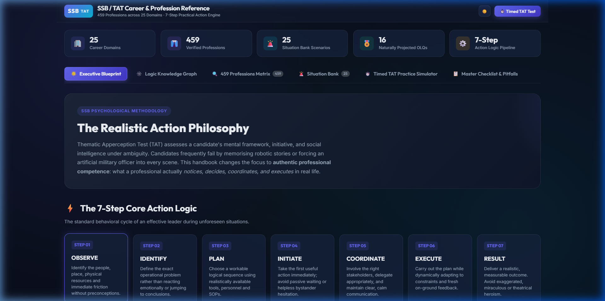
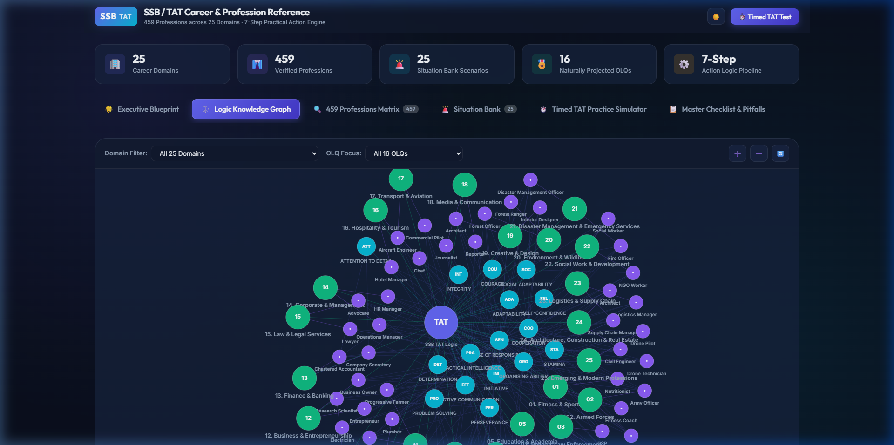
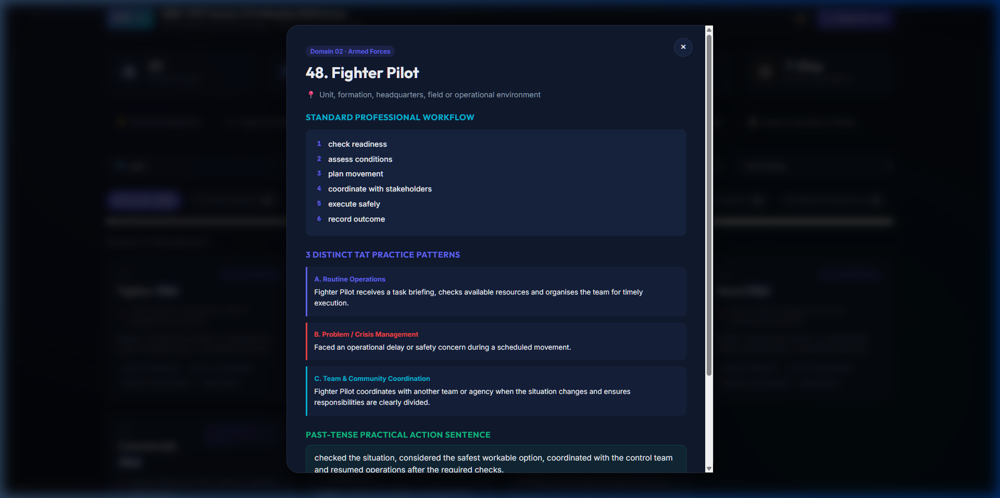
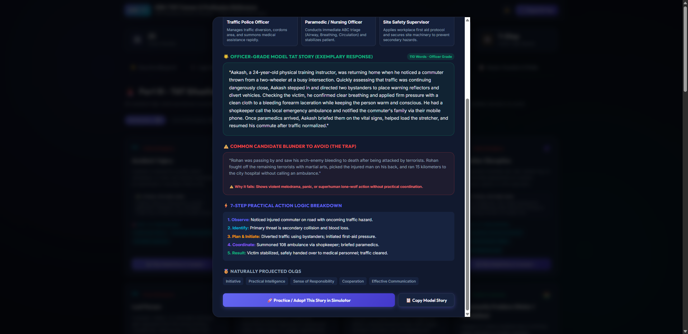
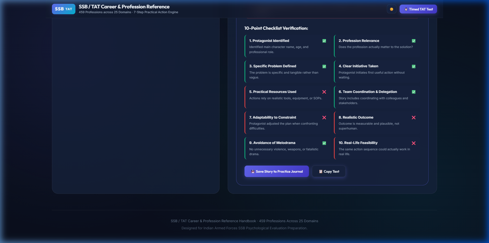
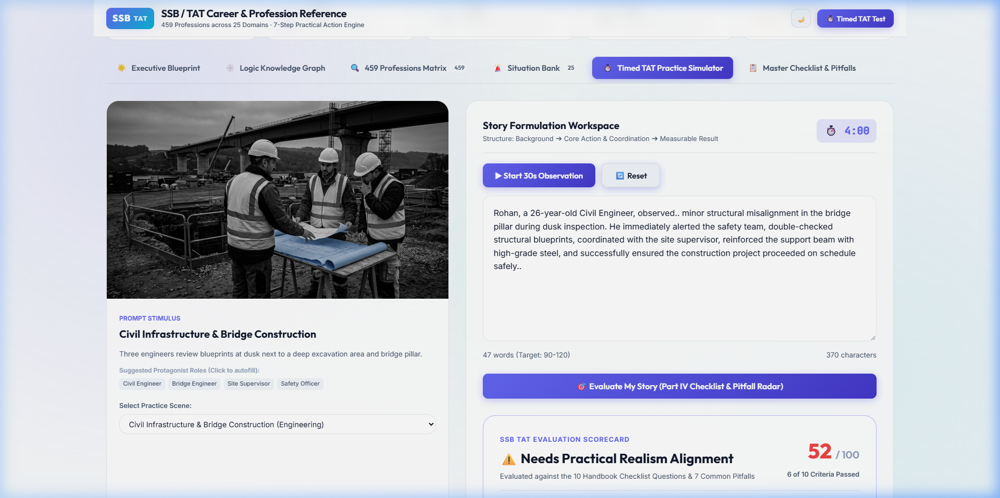

<div align="center">

# 🎖️ SSB / TAT Master Career & Profession Reference Suite
### 459 Professions across 25 Domains · 7-Step Practical Action Engine · Interactive Knowledge Graph & Timed Simulator

[](https://vercel.com)
[](LICENSE)
[](https://developer.mozilla.org/en-US/docs/Web/JavaScript)
[](https://github.com/your-username/ssb-tat-handbook/stargazers)

<p align="center">
  A state-of-the-art interactive psychological reference and practice simulator for the <strong>Services Selection Board (SSB)</strong> Thematic Apperception Test (TAT), based on the comprehensive <em>SSB Career & Profession Reference Handbook</em>.
</p>

[**Explore Live Demo**](https://vercel.com) · [**Report Issue**](../../issues) · [**Star This Repo ⭐**](../../stargazers)

</div>

---

## 📖 The Problem Solved

During the SSB Psychological Evaluation, candidates in the **Thematic Apperception Test (TAT)** often commit critical errors:
1. **The Melodrama Trap**: Forcing weapons, sudden bomb blasts, terrorists, or tragic deaths onto peaceful or ambiguous pictures.
2. **Lone-Wolf Syndrome**: Writing stories where the protagonist miraculously solves everything single-handedly without coordinating with team members or authorities.
3. **Robotic Clichés**: Artificially cramming "Officer Like Qualities (OLQs)" into the narrative (*"He displayed great initiative and honesty"*) instead of demonstrating them through **practical, sensible action**.

### 💡 The Solution: Authentic Professional Logic
This suite breaks down **459 distinct professions** across **25 career domains** (from Armed Forces and Engineering to Rural Development and Healthcare). It equips candidates with the **exact workflows, tools, environments, and coordination procedures** used by real-world professionals, allowing genuine leadership qualities to project naturally.

---

## ✨ Key Features & Architecture

### 1. 🌟 The 7-Step Core Action Logic Engine
An interactive stepper contrasting **Candidate Blunders** against **Recommended Officer Actions** through the standard psychological action cycle:
$$\text{Observe} \longrightarrow \text{Identify} \longrightarrow \text{Plan} \longrightarrow \text{Initiate} \longrightarrow \text{Coordinate} \longrightarrow \text{Execute} \longrightarrow \text{Result}$$

<p align="center">
  
</p>

---

### 2. 🕸️ Interactive Logic Knowledge Graph
A high-performance, force-directed canvas graph that maps relationships between:
- The central **TAT Psychological Hub**
- **25 Career Domains**
- **16 Officer Like Qualities (OLQs)**
- Filterable **Professions**

*Click any OLQ (e.g., "Practical Intelligence" or "Initiative") to see all connected professions and domains illuminate across the network!*

<p align="center">
  
</p>

---

### 3. 🔍 459 Professions Matrix & Live Explorer
Instant client-side fuzzy search across all 459 roles with multi-faceted filtering:
- Filter by **25 Career Domains** with real-time badges
- Filter by **16 SSB OLQ tags**
- **Deep-Dive Dossier Modal**: Shows the exact *Work Environment*, step-by-step *Professional Workflow*, **3 Distinct Practice Patterns** (*A. Routine, B. Crisis, C. Team/Community*), and *Past-Tense Practical Action Sequences*.

<p align="center">
  
</p>

---

### 4. 🚨 25-Scenario TAT Situation Bank & Story Intelligence Dossier
Interactive reference covering the 25 standard crisis, leadership, and operational triggers tested in SSB:
- **Categorized Filtration**: Rapidly filter across *Crisis & Emergency*, *Technical & Engineering*, *Logistics & Operations*, and *People & Leadership*.
- **3 Best-Fit Professions with Real-World Justifications**: Clear explanation of which roles naturally possess the tools, authority, and procedures to resolve each crisis.
- **🌟 Officer-Grade Model Stories (90–110 words)**: Exemplary past-tense narratives demonstrating ground-level competence and team coordination.
- **⚠️ Candidate Blunder Traps**: Real examples of melodrama, lone-wolf heroism, and panic stories contrasted against the recommended officer response.
- **7-Step Action Logic Breakdown**: Step-by-step trace showing *Observe ➔ Identify ➔ Plan & Initiate ➔ Coordinate ➔ Result*.
- **1-Click Simulator Integration**: Click *Practice / Adapt This Story in Simulator* to launch timed practice immediately.

<p align="center">
  
</p>

---

### 5. ⏱️ Timed TAT Practice Simulator & Rubric Radar
An authentic recreation of the SSB testing environment:
- **30-Second Observation Slide**: High-resolution photographic prompt stimuli with observation countdown and key cues.
- **4-Minute Writing Countdown**: Timed workspace with live word counters, warning alerts at 60s and 30s, and Web Audio pings.
- **Instant Story Evaluation Engine**: Evaluates your submitted story against the **10-Point Checklist** and scans for **7 Lethal Pitfalls** (lone-wolf syndrome, preachy adjectives, uncalled-for violence), giving an instant **TAT Readiness Score (/100)**.

<p align="center">
  
</p>

---

### 6. ☀️/🌙 Dual Theme Engine
Optimized for long study sessions with high-contrast military slate dark mode and daylight light mode:

<p align="center">
  
</p>

---

## 🗂️ Project Structure

```bash
ssb-tat-handbook/
├── index.html                   # Master single-page application
├── vercel.json                  # Vercel deployment configuration & caching rules
├── package.json                 # Project metadata
├── .gitignore                   # Clean deployment filter
├── css/
│   └── styles.css               # Glassmorphic responsive design system
├── js/
│   ├── data.js                  # 459 professions, 25 domains & prompts (zero-CORS)
│   ├── graph.js                 # Interactive HTML5 Canvas Force Graph
│   ├── explorer.js              # Real-time search & faceted profession matrix
│   ├── situation-bank.js        # 25-scenario solver & recommendation engine
│   ├── simulator.js             # 30s/4m test timer & 10-point checklist radar
│   └── app.js                   # Application coordinator & theme engine
└── assets/
    ├── images/                  # Photographic TAT stimulus scenarios
    └── screenshots/             # Documentation & demo assets
```

---

## 🚀 Quick Start & Local Run

No complex build steps or installations required. The app is completely self-contained with **zero external dependencies**:

```bash
# Clone the repository
git clone https://github.com/your-username/ssb-tat-handbook.git
cd ssb-tat-handbook

# Run with any local server (e.g. Python)
python -m http.server 8080

# Open in your browser
http://localhost:8080
```

*You can also directly double-click `index.html` to run offline in any modern browser!*

---

## 🤝 Contributing

Contributions are very welcome! If you have additional profession workflows, real-world SOP templates, or scenario bank prompts:
1. Fork the Project
2. Create your Feature Branch (`git checkout -b feature/NewProfession`)
3. Commit your Changes (`git commit -m 'Add new profession workflow'`)
4. Push to the Branch (`git push origin feature/NewProfession`)
5. Open a Pull Request

---

## ⭐️ Show Your Support

If this reference guide and simulator helped your SSB preparation or coding project, **please star this repository**! It helps other candidates and developers discover this resource.

---

<div align="center">
  <sub>Crafted for Defense Aspirants & Candidates preparing for Indian Armed Forces (Army, Navy, Air Force) SSB Interviews.</sub>
</div>
